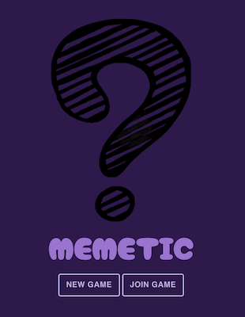
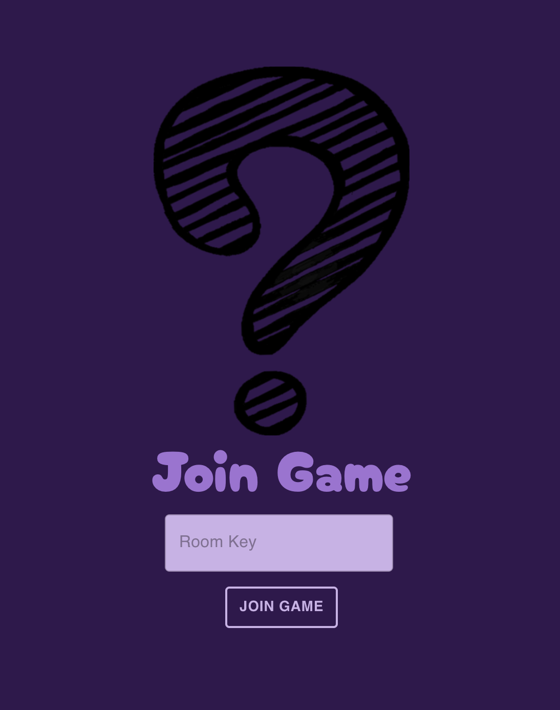
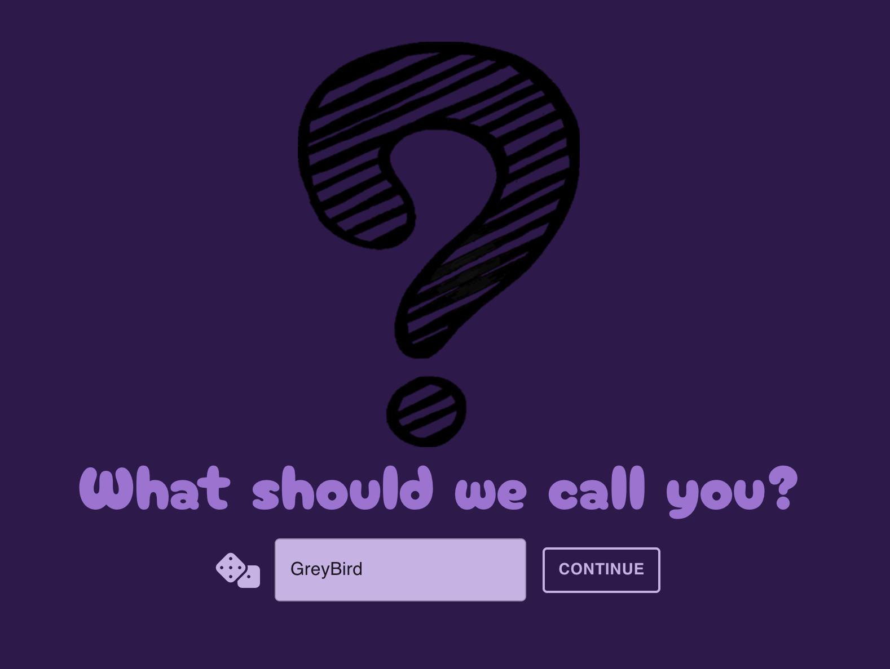
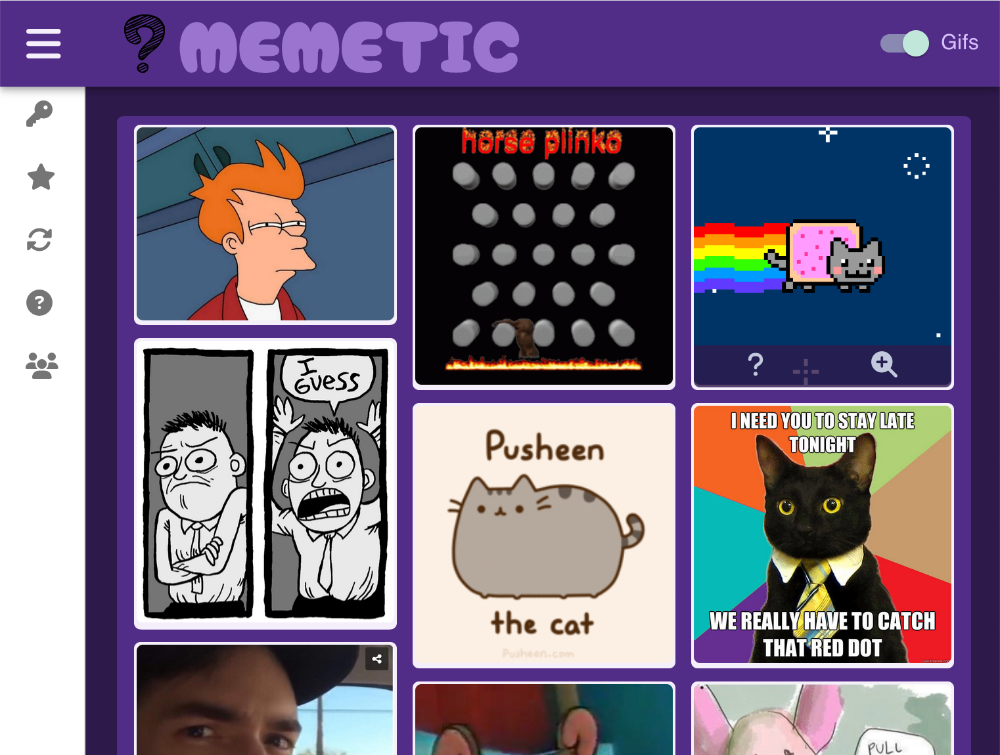
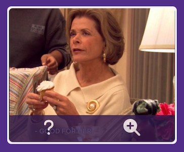
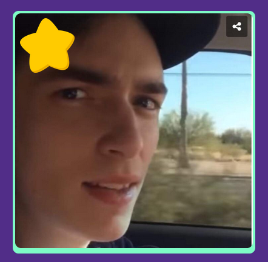
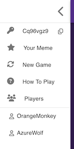

# MEMETIC

A web-based multiplayer game inspired by the classic **“Guess Who?”**, but with **memes** instead of cartoon faces! Players ask yes/no questions to guess their opponent’s secret meme. Built with **Vite + React**, **react-use-websocket** for real-time communication, and **Material UI** for sleek styling.

---

## ✨ Features

* 🎨 Meme-based “Guess Who” boards
* 🧑‍🤝‍🧑 Real-time multiplayer via websockets
* 📐 Dynamic grid layout that auto-sorts images into best-fit columns by height
* 💅 Modern UI using Material UI components
* ⚡️ Fast development with Vite
* 🎞️ Toggle to play GIFs only when hovered
* 🔗 Link to meme source shown on hover
* 🎯 Guess Opponent’s Card with confirmation prompts and win-condition logic
* 🧑‍🤝‍🧑 Two-Player Rooms with Observer Mode
* 💬 Live chat for all room members

---

## ⚙️ Dynamic Grid Algorithm

This project includes a custom algorithm to **dynamically arrange meme images** into columns with approximately equal height. This provides a **Pinterest-style responsive grid**, ensuring the meme board is balanced and visually appealing even with images of varying aspect ratios.

> ✅ Automatically calculates optimal column assignment
>
> ✅ Supports responsive resizing

---

### 📌 To Do

* 💬 Live chat in rooms

### 🚀 Ideas for Future

* ⏳ Specific alternate still images for gifs
* ⬆️ Ability to upload new memes in-app

---

## 🛠️ Tech Stack

* **Frontend:** React (with Vite), TypeScript, Material UI, CSS/Styled Components
* **Real-time:** [react-use-websocket](https://github.com/robtaussig/react-use-websocket)
* **Backend:** Node.js (WebSocket server, TypeScript)
* **Styling/Layout:** Material UI theming, CSS styling, custom image-sorting algorithm for responsive boards

---

## 🧩 Plugins / Packages Used

* [`react-use-websocket`](https://www.npmjs.com/package/react-use-websocket) – easy WebSocket integration for React
* [`react-card-flip`](https://www.npmjs.com/package/react-card-flip) – smooth flipping animation for cards
* [`react-freezeframe`](https://www.npmjs.com/package/react-freezeframe) – freeze and control animated GIFs
* [`usebreakpoint`](https://www.npmjs.com/package/use-breakpoint) – React hook for handling responsive breakpoints
* [`@faker-js/faker`](https://www.npmjs.com/package/@faker-js/faker) – generate fake data for random usernames
* [`react-confetti-explosion`](https://www.npmjs.com/package/react-confetti-explosion) – confetti on a correct guess
* [`chat-ui-kit-react`](https://github.com/chatscope/chat-ui-kit-react) – for chat box styling

---

## ⚙️ Setup Instructions

### 1️⃣ Clone the repository

```bash
git clone https://github.com/marshallhelenm/MEMETIC.git
cd MEMETIC
```

### 2️⃣ Install dependencies

```bash
# Frontend
cd client
npm install

# Backend
cd ../server
npm install
```

### 3️⃣ Run locally

#### 🐳 With Docker Compose (recommended)

```bash
# From the project root
docker-compose up --build
```

This will start both the backend and frontend in production mode. Access the app at [http://localhost](http://localhost).

#### For local development without Docker

```bash
# Start backend
cd server
npm run dev

# Start frontend (Vite dev server)
cd ../client
npm run dev
```

---

## 🌐 How to Play

1. Join a game room.
2. View your dynamically arranged meme board.
3. Choose your secret meme.
4. Take turns asking yes/no questions.
5. Use logic to narrow down and guess your opponent’s meme!

---

## 🙏 Acknowledgments

* Classic *Guess Who?* board game for the concept
* This [TikTok that inspired the idea](https://ve.media.tumblr.com/tumblr_q8otm9qrlU1w0qmsw.mp4)
* Meme creators everywhere
* [Know Your Meme](https://knowyourmeme.com)
* [en.meming.world](https://en.meming.world)
* [Material UI](https://mui.com/) for UI components

---

## 🚀 Demo

> *Coming Soon*

---

## 📸 Screenshots












---
